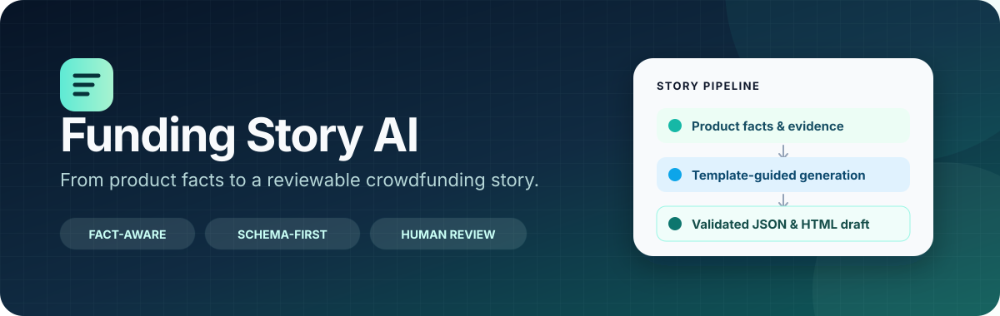
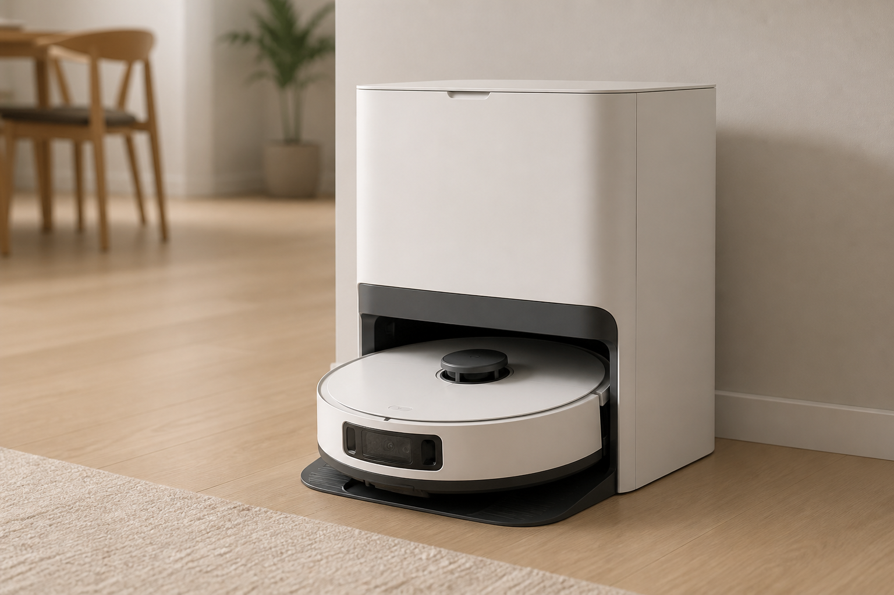
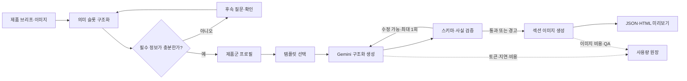

<p align="center">
  
</p>

<p align="center">
  <a href="https://www.python.org/"></a>
  <a href="https://docs.astral.sh/uv/"></a>
  <a href="https://github.com/langchain-ai/langgraph"></a>
  <a href="https://github.com/pakyeon/funding-story-ai/actions/workflows/ci.yml"></a>
</p>

<p align="center">
  제품 사실과 이미지를 구조화된 펀딩 스토리로 변환하고,<br>
  미제공 정보를 구분한 채 검토 가능한 JSON·HTML 초안을 만듭니다.
</p>

---

Funding Story AI는 제품 설명을 곧바로 긴 광고 문구로 바꾸지 않습니다. 먼저 사실,
주장, 증빙, 미확인 정보를 구조화하고 부족한 정보를 질문한 뒤, 제품군 프로필과
스토리 템플릿을 사용해 초안을 생성합니다. 생성 결과는 스키마와 사실성 검사를 거치며
항상 사람의 최종 검토를 요구합니다.

[빠른 시작](#-빠른-시작) · [실제 사례](#-어떻게-사용할-수-있나요) ·
[아키텍처](#-아키텍처) · [설계 문서](#-문서) · [한계](#-현재-범위와-한계)

## 왜 Funding Story AI인가요?

일반 LLM은 그럴듯한 스토리를 빠르게 만들지만 입력되지 않은 인증, 일정, 후기나
비교 수치까지 채울 수 있습니다. 이 프로젝트는 생성 전후에 구조적인 경계를 둡니다.

- **사실 우선** — 제품 사실·주장·증빙·미확인 정보를 서로 다른 필드로 관리합니다.
- **질문 가능한 입력** — 필요한 정보가 없으면 생성 전에 보완 질문이나 명시적 건너뛰기를 선택합니다.
- **템플릿 기반 구성** — 톤과 문구만이 아니라 섹션 역할·순서·시각 요구사항을 명세합니다.
- **검토 가능한 결과** — 문장별 `source_fields`, 경고, 사용량과 비용을 결과에 남깁니다.
- **선택적 이미지 생성** — 제품 참조 이미지를 유지하거나 텍스트에서 일관된 시드 이미지를 만듭니다.

## 🚀 빠른 시작

### 1. 설치

Python 3.12와 [uv](https://docs.astral.sh/uv/)가 필요합니다.

```bash
git clone https://github.com/pakyeon/funding-story-ai.git
cd funding-story-ai
uv sync --locked
cp .env.example .env
```

`.env`에서 `GOOGLE_CLOUD_PROJECT`와 호출 비용 상한을 설정하고 Vertex AI용 Application
Default Credentials를 준비합니다.

```bash
gcloud auth application-default login
```

### 2. 데이터 계약 확인

API를 호출하지 않고 템플릿, 프로필, 예제와 JSON Schema를 검증합니다.

```bash
uv run funding-story validate
```

### 3. 비용과 템플릿 선택 미리 보기

```bash
uv run funding-story generate \
  --brief-path examples/robot-vacuum/brief.json \
  --category-profile robot-vacuum-ko-v1 \
  --dry-run
```

포함된 예제에서는 `t02_problem_solution_automation`이 선택되며, 모델 호출 전 예상 비용,
선택 점수와 선택 근거를 JSON으로 확인할 수 있습니다.

### 4. 스토리 생성

```bash
uv run funding-story generate \
  --brief-path examples/robot-vacuum/brief.json \
  --category-profile robot-vacuum-ko-v1 \
  --live \
  --output artifacts/story.json
```

Python 코드에서는 작은 공개 API만 사용하면 됩니다.

```python
from pathlib import Path

from funding_story_ai import StoryGenerator

generator = StoryGenerator.from_env()
story = generator.generate(
    Path("examples/robot-vacuum/brief.json"),
    profile="robot-vacuum-ko-v1",
)

print(story["title_candidates"])
print(story["warnings"])
```

이미지 단계는 선택 사항입니다. 실제 호출 전 `--dry-run`으로 이미지 수와 비용 예약치를
먼저 확인할 수 있습니다.

```bash
uv run funding-story images \
  --story artifacts/story.json \
  --reference examples/robot-vacuum/product-reference.png \
  --dry-run
```

## 🧹 포함된 사례: 합성 로봇청소기

<p align="center">
  
</p>

이 예제는 실제 판매 제품이나 공개 펀딩 원문이 아닌 합성 데이터입니다.

| 입력 영역 | 예제 내용 | 시스템 처리 |
|---|---|---|
| 제품 사실 | 흡입력, 작동 시간, 물걸레·도크 사양 | 수치와 단위를 구조화하고 출처 ID 연결 |
| 사용자 문제 | 반복 청소와 청소 후 관리 부담 | 문제–해결형 템플릿 선택 신호로 사용 |
| 증빙 | 합성 자체 시험 2건 | 외부 인증으로 표현하지 않도록 제한 |
| 미확인 | 가격, 배송일, 외부 인증, 보증 등 | 값을 만들지 않고 입력 필요 상태로 유지 |
| 결과 | 10개 섹션의 구조화 스토리 | JSON Schema 검사와 최대 1회 제한 수정 |

예제 파일:

- [`brief.json`](examples/robot-vacuum/brief.json) — 사실·주장·증빙·미확인 정보
- [`product-reference.png`](examples/robot-vacuum/product-reference.png) — 합성 제품 이미지
- [`robot-vacuum-ko-v1.json`](profiles/robot-vacuum-ko-v1.json) — 제품군별 질문·선택 힌트

## 💡 어떻게 사용할 수 있나요?

### 제품 출시 초안

확정된 제품 사실과 타깃을 입력하면 히어로, 문제, 해결, 기능, 신뢰, 일정과 CTA 역할을
가진 편집 가능한 초안을 만듭니다.

### 근거가 부족한 초기 기획

시험, 인증, 후기 또는 팀 정보가 없다면 그럴듯한 값을 보완하지 않고 질문하거나
미등록 상태로 남깁니다. 초기 아이디어를 사실처럼 포장하지 않으면서 스토리 골격을
먼저 검토할 수 있습니다.

### 변경된 사양 반영

이전 수치와 확정 수치를 분리해 최신 값을 권위값으로 지정할 수 있습니다. 검증기는
폐기된 수치가 결과에 다시 나타나는지 확인합니다.

### 제품군 확장

코어 질문 그래프를 수정하지 않고 category profile에 추출 힌트, 질문 예시, 키워드와
템플릿 soft boost를 추가할 수 있습니다. 현재 실제 검증 프로필은 로봇청소기 한 종류입니다.

## 🏗 아키텍처



LangGraph는 질문과 생성·검증 재시도 흐름만 제어합니다. 템플릿, 프롬프트, 모델
어댑터, 사실 검증기와 렌더러는 독립 모듈로 유지합니다. 자세한 내용은
[`docs/architecture.md`](docs/architecture.md)를 참고하세요.

## 핵심 기능

| 기능 | 현재 구현 |
|---|---|
| 입력 계약 | JSON Schema 기반 제품·사실·주장·증빙·미확인 정보 |
| 질문 정책 | 필수 정보, 선택적 신뢰 정보, 통합 질문, 확인과 명시적 건너뛰기 |
| 템플릿 | 성능·증빙형, 문제–해결형, 라이프스타일형, 전체 캠페인형 |
| 선택 | 설명 가능한 규칙 점수와 profile soft boost |
| 텍스트 | Gemini 3.7 Flash 우선, 접근 실패 5회 뒤 3.6 Flash 폴백 |
| 검증 | 결과 스키마, 수치, 미지원 기능·인증·일정과 출처 필드 검사 |
| 이미지 | `gpt-image-2` 참조 편집 또는 텍스트 시드 생성, 섹션별 실패 격리 |
| 결과 | 구조화 JSON, 안전한 Markdown 부분집합, HTML 미리보기 |
| 비용 | 요청 전 상한 검사와 호출별 토큰·지연·추정 비용 JSONL |

## 사실성 원칙

이 프로젝트에서 `자동 검증 통과`는 사실을 외부에서 증명했다는 뜻이 아닙니다.
입력과 결과가 충돌하지 않고, 입력되지 않은 내용을 단정하는 알려진 패턴이 감지되지
않았다는 의미입니다.

1. 사용자가 제공한 수치는 `user-stated-unverified` 상태일 수 있습니다.
2. 자체 시험과 외부 인증을 구분합니다.
3. 미입력 가격·일정·후기·인증·AS는 생성하지 않습니다.
4. 모든 결과는 `review_required: true`입니다.
5. 이미지도 사람 QA를 통과한 자산만 미리보기에 사용합니다.

자세한 규칙은 [`docs/factuality-and-validation.md`](docs/factuality-and-validation.md)에 있습니다.

## 검증 상태

- Python 3.12, uv 잠금 파일
- Ruff 정적 검사 통과
- pytest **49개 통과**
- 템플릿 4개와 로봇청소기 profile 1개 JSON Schema 검증
- 로컬 CLI `validate`와 `generate --dry-run` 확인

이 구현의 설계 근거가 된 선행 비공개 PoC는 로봇청소기 범위에서 질문 상태 8/8과
Behavioral Parity 89/100을 기록했습니다. 새 저장소는 이 결과를 연구 근거로만 사용하며,
특정 서비스와 완전히 동일하거나 모든 제품군에 일반화됐다고 주장하지 않습니다.
평가 범위는 [`docs/research/poc-evaluation-summary.md`](docs/research/poc-evaluation-summary.md)에
정리했습니다.

## 프로젝트 구조

```text
funding-story-ai/
├── src/funding_story_ai/   # 입력, 생성, 검증, 이미지, 렌더링, CLI
├── schemas/                # 공개 데이터 계약
├── templates/              # 구조화 스토리 골격과 카탈로그
├── profiles/               # 제품군별 질문·선택 힌트
├── examples/               # 재현 가능한 합성 입력
├── docs/                   # 설계와 제한된 연구 요약
└── tests/                  # 모델 호출 없이 실행되는 회귀 테스트
```

## 📚 문서

- [아키텍처](docs/architecture.md)
- [템플릿 시스템](docs/template-system.md)
- [사실성·검증](docs/factuality-and-validation.md)
- [제품군 프로필](docs/category-profiles.md)
- [관찰 가능한 Story AI 동작](docs/research/observable-story-ai-behavior.md)
- [PoC 평가 요약](docs/research/poc-evaluation-summary.md)
- [현재 한계](docs/research/limitations.md)

## 현재 범위와 한계

- 한국어와 로봇청소기 profile만 실제 검증했습니다.
- 웹 UI와 배포 서버는 포함하지 않습니다.
- 템플릿 구조가 실제 펀딩 성과를 유발한다고 주장하지 않습니다.
- 모델 가격은 구성 가능한 추정치이며 실제 Billing과 다를 수 있습니다.
- 외부 사실 검증 검색이나 광고 심사 시스템은 아직 연결하지 않았습니다.
- 생성 이미지의 제품 동일성과 표시 적합성은 사람 검수가 필요합니다.

## 프로젝트 관계

이 저장소는 공개 크라우드펀딩 자료와 관찰 가능한 Story AI 동작을 참고해 만든 독립
구현입니다. 와디즈와 공식 제휴·승인·연동된 프로젝트가 아니며, 비공개 프롬프트·API·
모델·템플릿 원본을 포함하지 않습니다.

README의 정보 구성은 [Outlines](https://github.com/dottxt-ai/outlines)의 명확한
`Why → Quickstart → Real-world examples → Features` 흐름에서 영감을 받았으며, 디자인,
문구, 코드와 예제는 이 프로젝트를 위해 새로 작성했습니다.
