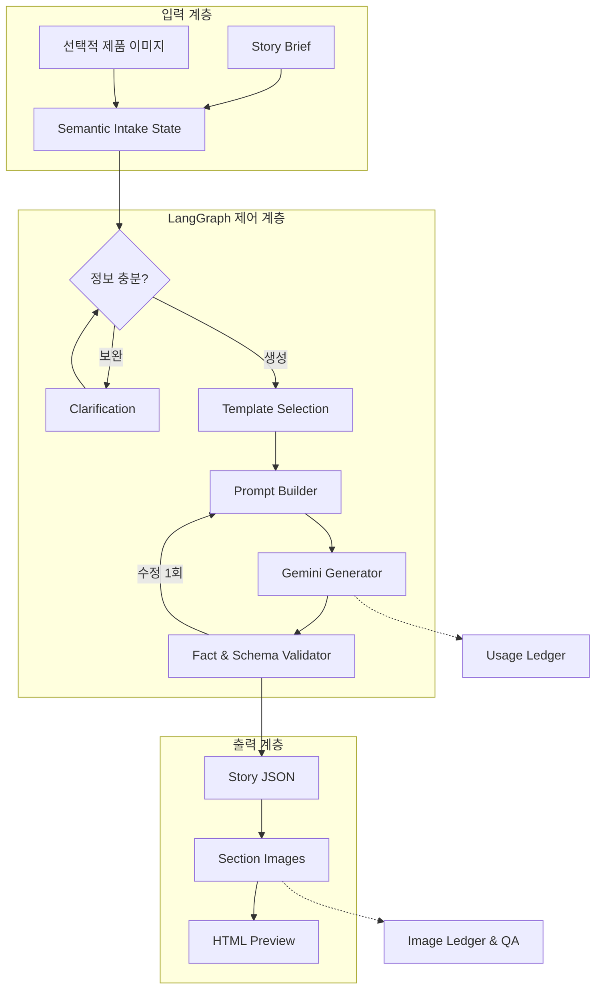

# 아키텍처

Funding Story AI는 대화 입력, 스토리 생성, 이미지 생성과 검증을 한 프롬프트에 결합하지
않는다. 각 단계가 별도 데이터 계약을 사용해 실패 범위와 교체 지점을 명확히 한다.

## 전체 흐름



## 모듈 경계

| 모듈 | 책임 | 교체 가능 지점 |
|---|---|---|
| `intake.py` | 의미 슬롯에 따른 질문·확인 상태 전이 | 질문 정책, UI |
| `data_repository.py` | 스키마·템플릿·profile·예제 로딩과 검증 | 저장소, DB |
| `selector.py` | 설명 가능한 규칙 점수와 soft boost | 검색·재정렬기 |
| `prompting.py` | 브리프와 템플릿을 생성 명세로 조립 | 프롬프트 버전 |
| `adapter.py` | Gemini JSON 호출, 재시도와 폴백 | 모델 공급자 |
| `pipeline.py` | 선택→생성→검증→제한 수정 | 실행 그래프 |
| `validation.py` | 스키마 외 사실·수치·미지원 주장 검사 | 정책 검증기 |
| `image_pipeline.py` | 섹션 이미지 계획과 실패 격리 | 이미지 공급자 |
| `preview.py` | 안전한 Markdown 부분집합을 HTML로 렌더링 | 편집기·UI |
| `usage.py` | 토큰·지연·비용 원장과 호출 전 상한 | 관측 시스템 |

## 두 개의 LangGraph

입력 그래프와 생성 그래프는 분리한다.

### 입력 그래프

```text
initial
→ primary-details
→ secondary-details
→ confirmation
→ ready-to-generate
```

정책에 따라 primary와 secondary를 `combined-details`로 묶거나 사용자가 질문을 명시적으로
건너뛸 수 있다. 자동 생성 분기는 제공하지 않는다.

### 생성 그래프

```text
select_template
→ build_prompt
→ generate_story
→ validate_story
→ prepare_retry (최대 1회)
→ finalize
```

검증 경고가 남아도 결과를 숨기지 않는다. `review_required: true`와 경고를 함께 반환해
사람이 수정 여부를 판단하게 한다.

## 데이터 계약

- `story-brief`: 입력 사실, 주장, 증빙, 에셋, 리워드와 미확인 정보
- `story-intake-semantic-state`: 질문 정책이 사용하는 제품군 독립 슬롯
- `category-profile`: 제품군별 질문 예시와 템플릿 soft boost
- `story-template`: 스타일, 콘텐츠 전략과 순서가 있는 섹션 골격
- `story-generation-content`: 모델이 반환해야 하는 최소 JSON
- `story-result`: 실행 메타데이터와 경고가 결합된 결과
- `story-image-manifest`: 이미지별 입력 방식, 비용, 해시와 QA 상태

이 계약은 특정 서비스의 비공개 payload를 표현하지 않는다.

## 실패 처리

- Gemini 접근 오류는 기준 모델을 최대 5회 확인한 뒤 폴백 모델을 사용한다.
- 결과 스키마 또는 사실성 경고는 전체 결과를 대상으로 최대 1회 수정한다.
- 이미지 한 장의 실패는 다른 섹션 이미지 생성을 취소하지 않는다.
- 호출 전 보수적 최대 사용량으로 설정된 비용 상한을 검사한다.
- 출력 파일이 이미 존재하면 덮어쓰지 않는다.
